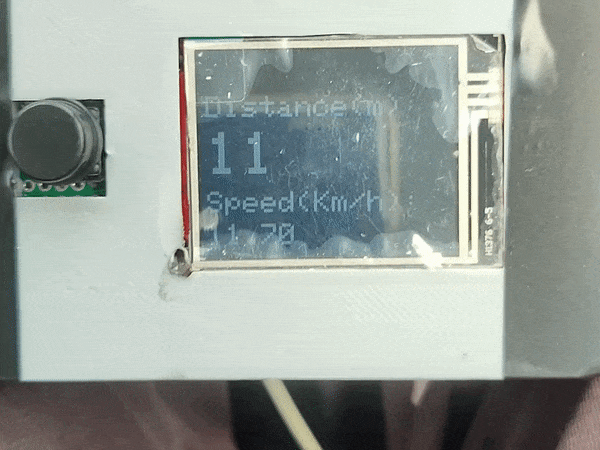
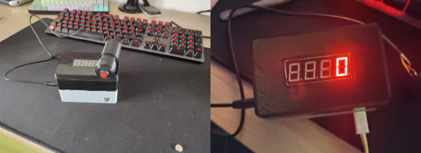

# GPS TripMeter
A tripmeter that uses GPS to calculate distance traveled and current speed.

It is possible to reset the trip by pressing the button

The data are shown on a 1.8" TFT display 

Or on a 8 digit display.

## Motivation

Need to calculate the distance traveled in order to follow road notes.

## 1.8 TFT Display wiring

| Dsiplay | Arduino Nano |
|---------|--------------|
| VCC     | 5V           |
| GND     | GND          |
| CS      | D10          |
| RESET   | D8           |
| A0      | D9           |
| SDA     | D11          |
| SCK     | D13          |
| LED     | 3.3V         |

## 8 Digit Display wiring

| Dsiplay | Arduino Nano |
|---------|--------------|
| VCC     | 5V           |
| GND     | GND          |
| DIO     | D10          |
| CLK     | D9           |

## GPS Wiring

| GPS | Arduino Nano |
|-----|--------------|
| VCC | 5V           |
| GND | GND          |
| TX  | D6           |
| RX  | D7           |

## Button Wiring

| Button | Arduino Nano           |
|--------|------------------------|
| VCC    | 5V                     |
| GND    | GND + 10K Ohm Resistor |
| PIN    | D2                     |

## Hardware

- Arduino Nano
- Touchscreen Display of your choice.
- GPS module
